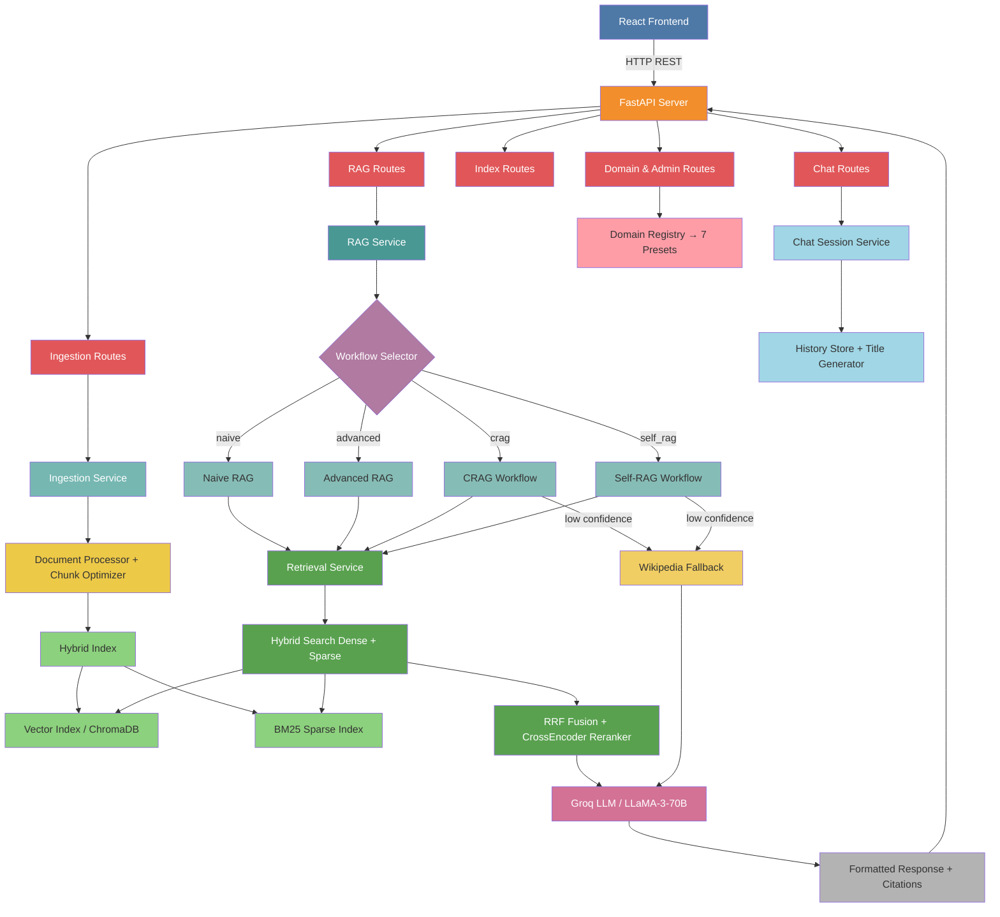

# AutoDocThinker: Agentic RAG System with Intelligent Search Engine

[](https://python.org) [](https://fastapi.tiangolo.com/) [](https://python.langchain.com/) [](https://langchain-ai.github.io/langgraph/) [](https://pytorch.org/) [](https://huggingface.co/) [](https://www.trychroma.com/) [](https://www.docker.com/) [](https://reactjs.org/) [](https://tailwindcss.com/) [](https://groq.com/) [](https://github.com/Md-Emon-Hasan/AutoDocThinker)

**AutoDocThinker** (v3.0) is an advanced **Agentic RAG (Retrieval-Augmented Generation)** system designed to bridge the gap between static documents and dynamic intelligence, solving the critical problem of information overload in data-rich environments. Built on a **Modular Monolithic Architecture** with **FastAPI, LangGraph, and ChromaDB**, the system transforms unstructured data (PDFs, Word docs, Web URLs, plain text) into an interactive knowledge base, enabling users to query complex information using natural language. Unlike traditional keyword search that fails to understand context, AutoDocThinker employs a **four-mode RAG workflow engine** — **Naive, Advanced, CRAG (Corrective RAG), and Self-RAG** — to adaptively route, retrieve, evaluate, and regenerate answers. The **Hybrid Search engine** fuses **dense vector retrieval (ChromaDB)** with **sparse BM25 indexing** via **Reciprocal Rank Fusion (RRF)**, followed by **CrossEncoder reranking**, to deliver precision-first results. Seven **domain-specific presets** (Medical, Legal, Finance, Technical, Education, Customer Support, General) tune prompts and retrieval behavior per use case, while a full **chat session system** maintains multi-turn conversation history. This end-to-end solution not only automates research and Level-1 support tasks but also delivers **10x productivity gains** by synthesizing accurate, citation-backed answers in seconds — effectively turning a repository of "dead" files into an active, decision-driving organizational brain.

<!-- 🎥 Project Demo Video -->
[](https://github.com/user-attachments/assets/a18dc570-35fc-4c42-8bad-fd6be37b6c0a)

<!-- 📸 Project Screenshots -->
<p align="center">
  
</p>

<p align="center">
  
</p>

---

## **Live Demo**

**Try it now**: [AutoDocThinker: Agentic RAG System with Intelligent Search Engine](https://autodocthinker.onrender.com/)

---

## **Features & Functionalities**

| #  | Module                   | Technology Stack                        | Implementation Details                                       |
|----|--------------------------|-----------------------------------------|--------------------------------------------------------------|
| 1  | **Backend Framework**    | FastAPI + Uvicorn                       | Async support, auto OpenAPI docs, lifecycle hooks            |
| 2  | **LLM Processing**       | Groq + LLaMA-3-70B                      | Configurable temperature, output parsing, retry logic        |
| 3  | **Document Parsing**     | PyMuPDF + python-docx + BeautifulSoup   | PDF, DOCX, TXT, URL, raw text with metadata preservation     |
| 4  | **Text Chunking**        | RecursiveCharacterTextSplitter          | Adaptive chunk optimizer with configurable size and overlap  |
| 5  | **Vector Embeddings**    | all-MiniLM-L6-v2 (HuggingFace)         | Efficient 384-dimensional dense embeddings                   |
| 6  | **Vector Database**      | ChromaDB                                | Persistent storage, similarity search, source-level deletion |
| 7  | **Sparse Index**         | BM25 (rank-bm25)                        | Keyword-based sparse retrieval with custom tokenizer         |
| 8  | **Hybrid Search**        | Dense + Sparse fusion via RRF           | Reciprocal Rank Fusion merges both retrieval signals         |
| 9  | **Reranking**            | CrossEncoder (sentence-transformers)    | Re-scores top-K candidates for precision-first results       |
| 10 | **Compression**          | LLM-based context compression           | Reduces retrieved chunks to only query-relevant sentences    |
| 11 | **RAG Workflows**        | LangGraph (4 modes)                     | Naive, Advanced, CRAG, Self-RAG with conditional edges       |
| 12 | **Domain Presets**       | 7 domain profiles                       | General, Medical, Legal, Finance, Education, Technical, CS   |
| 13 | **Prompt Engineering**   | Domain-aware prompt templates           | Separate system prompts per domain and per RAG workflow      |
| 14 | **Chat System**          | Session-based multi-turn chat           | Session management, history store, auto title generation     |
| 15 | **Web Fallback**         | Wikipedia API + LangChain               | Auto-triggered on low-confidence or empty index              |
| 16 | **CLI Interface**        | Interactive terminal CLI                | Commands for ingestion, querying, and session management     |
| 17 | **Source Management**    | Per-source ingestion tracking           | Deduplication, source registry, per-source deletion          |
| 18 | **Index Management**     | Full index lifecycle control            | Status, per-source removal, full clear                       |
| 19 | **User Interface**       | React 18 + Vite + Tailwind CSS          | SPA with chat, ingestion, domains, index, and admin pages    |
| 20 | **Containerization**     | Docker + Docker Compose                 | Production-ready multi-service deployment                    |

---

## **Project Structure**

```
AutoDocThinker/
│
├── .github/
│   └── workflows/
│       ├── ci-cd.yml                         # Full CI/CD pipeline (lint → test → build → deploy)
│       └── docker.yml                        # Docker build & push to GHCR on release
│
├── backend/                                  # FastAPI backend application
│   ├── .dockerignore
│   ├── .env.example                          # Environment variables template
│   ├── .flake8                               # Flake8 linting configuration
│   ├── Dockerfile                            # Backend Docker image
│   ├── pyproject.toml                        # Project metadata and tool config
│   ├── requirements.txt                      # Python dependencies
│   ├── run.py                                # Backend entry point (Uvicorn launcher)
│   ├── split.py                              # Dev utility for splitting test output
│   │
│   ├── app/                                  # Main application package
│   │   ├── __init__.py
│   │   ├── application.py                    # FastAPI app factory
│   │   ├── dependencies.py                   # DI container (IoC box)
│   │   ├── exceptions.py                     # Global exception handlers
│   │   ├── lifecycle.py                      # Startup / shutdown hooks
│   │   ├── logging_config.py                 # Structured logging setup
│   │   ├── main.py                           # ASGI entry point
│   │   │
│   │   ├── api/                              # HTTP route handlers
│   │   │   ├── __init__.py
│   │   │   ├── admin_routes.py               # GET /admin/summary
│   │   │   ├── chat_routes.py                # Chat session CRUD & query
│   │   │   ├── domain_routes.py              # Domain preset listing
│   │   │   ├── health_routes.py              # GET /health
│   │   │   ├── index_routes.py               # Index status, clear, per-source delete
│   │   │   ├── ingestion_routes.py           # File upload, URL, raw text ingestion
│   │   │   ├── rag_routes.py                 # RAG query, mode listing, profiles
│   │   │   └── router.py                     # Central router aggregator
│   │   │
│   │   ├── chat/                             # Chat session management
│   │   │   ├── __init__.py
│   │   │   ├── history_store.py              # In-memory chat history store
│   │   │   ├── memory.py                     # LangChain memory adapter
│   │   │   ├── message.py                    # Message dataclass
│   │   │   ├── service.py                    # Chat service (create/get/query session)
│   │   │   ├── session.py                    # Session model
│   │   │   └── title_generator.py            # Auto-generate session titles via LLM
│   │   │
│   │   ├── cli/                              # Interactive command-line interface
│   │   │   ├── __init__.py
│   │   │   ├── commands.py                   # CLI command definitions
│   │   │   ├── interactive.py                # REPL loop
│   │   │   └── printing.py                   # Rich terminal output helpers
│   │   │
│   │   ├── core/                             # Core config & constants
│   │   │   ├── __init__.py
│   │   │   ├── config.py                     # RAGConfig frozen dataclass (v3.0.0)
│   │   │   ├── constants.py                  # App-wide constant values
│   │   │   ├── environment.py                # Env var loader
│   │   │   ├── errors.py                     # Base custom exception classes
│   │   │   └── paths.py                      # Path resolution helpers
│   │   │
│   │   ├── domain/                           # Domain preset system
│   │   │   ├── __init__.py
│   │   │   ├── defaults.py                   # Default domain selection logic
│   │   │   ├── models.py                     # Domain Pydantic models
│   │   │   ├── registry.py                   # Domain registry (name → preset)
│   │   │   ├── selector.py                   # Domain auto-selector
│   │   │   ├── validator.py                  # Domain input validator
│   │   │   └── presets/                      # Per-domain configuration
│   │   │       ├── __init__.py
│   │   │       ├── customer_support.py
│   │   │       ├── education.py
│   │   │       ├── finance.py
│   │   │       ├── general.py
│   │   │       ├── legal.py
│   │   │       ├── medical.py
│   │   │       └── technical.py
│   │   │
│   │   ├── indexing/                         # Hybrid index (vector + BM25)
│   │   │   ├── __init__.py
│   │   │   ├── bm25_index.py                 # BM25 sparse index implementation
│   │   │   ├── chroma_store.py               # ChromaDB collection wrapper
│   │   │   ├── deduplication.py              # Chunk deduplication logic
│   │   │   ├── hybrid_index.py               # Unified hybrid index interface
│   │   │   ├── locking.py                    # Thread-safe write locking
│   │   │   ├── persistence.py                # Index persistence helpers
│   │   │   ├── source_registry.py            # Per-source tracking registry
│   │   │   ├── stats.py                      # Index statistics
│   │   │   ├── tokenizer.py                  # Custom BM25 tokenizer
│   │   │   └── vector_index.py               # Vector index operations
│   │   │
│   │   ├── ingestion/                        # Document ingestion pipeline
│   │   │   ├── __init__.py
│   │   │   ├── chunk_optimizer.py            # Adaptive chunking strategy
│   │   │   ├── document.py                   # Document dataclass
│   │   │   ├── document_processor.py         # Load → clean → metadata injection
│   │   │   ├── file_validation.py            # File type and size validation
│   │   │   ├── metadata.py                   # Metadata extraction helpers
│   │   │   ├── service.py                    # Ingestion orchestrator
│   │   │   ├── source_id.py                  # Deterministic source ID generation
│   │   │   ├── supported_types.py            # Allowed file type registry
│   │   │   └── loaders/                      # Format-specific document loaders
│   │   │       ├── __init__.py
│   │   │       ├── base.py                   # Abstract loader interface
│   │   │       ├── docx_loader.py            # DOCX (python-docx) loader
│   │   │       ├── factory.py                # Routes file_type → loader instance
│   │   │       ├── pdf_loader.py             # PDF (PyMuPDF) loader
│   │   │       ├── text_loader.py            # Raw pasted-text loader
│   │   │       ├── txt_loader.py             # Plain .txt file loader
│   │   │       └── url_loader.py             # Web URL scraper (BeautifulSoup)
│   │   │
│   │   ├── llm/                              # LLM & embedding clients
│   │   │   ├── __init__.py
│   │   │   ├── chain_factory.py              # LangChain chain builder
│   │   │   ├── embedding_client.py           # HuggingFace embedding wrapper
│   │   │   ├── fallback.py                   # LLM fallback / error recovery
│   │   │   ├── groq_client.py                # Groq API client (LLaMA-3)
│   │   │   ├── output_parser.py              # Structured LLM output parser
│   │   │   └── wikipedia_client.py           # Wikipedia API client
│   │   │
│   │   ├── prompts/                          # Prompt templates
│   │   │   ├── __init__.py
│   │   │   ├── answer.py                     # Final answer generation prompt
│   │   │   ├── base.py                       # Base prompt template
│   │   │   ├── compression.py                # Context compression prompt
│   │   │   ├── crag.py                       # CRAG-specific prompts
│   │   │   ├── evaluation.py                 # Relevance evaluation prompt
│   │   │   ├── query_rewrite.py              # Query rewriting prompt
│   │   │   ├── self_rag.py                   # Self-RAG reflection prompts
│   │   │   └── domain/                       # Domain-specific system prompts
│   │   │       ├── __init__.py
│   │   │       ├── customer_support.py
│   │   │       ├── education.py
│   │   │       ├── finance.py
│   │   │       ├── general.py
│   │   │       ├── legal.py
│   │   │       ├── medical.py
│   │   │       └── technical.py
│   │   │
│   │   ├── rag/                              # RAG orchestration layer
│   │   │   ├── __init__.py
│   │   │   ├── citations.py                  # Citation extraction and formatting
│   │   │   ├── formatting.py                 # Response formatter
│   │   │   ├── history.py                    # Conversation history helpers
│   │   │   ├── modes.py                      # RAG mode enum (naive/advanced/crag/self_rag)
│   │   │   ├── service.py                    # RAG service (query entry point)
│   │   │   └── state.py                      # LangGraph shared state schema
│   │   │
│   │   ├── retrieval/                        # Retrieval & ranking pipeline
│   │   │   ├── __init__.py
│   │   │   ├── bm25_search.py                # BM25 sparse search
│   │   │   ├── compressor.py                 # LLM-based chunk compressor
│   │   │   ├── filters.py                    # Metadata pre-filters
│   │   │   ├── fusion.py                     # Reciprocal Rank Fusion (RRF)
│   │   │   ├── hybrid_search.py              # Combined dense + sparse search
│   │   │   ├── ranking.py                    # Score normalization & ranking
│   │   │   ├── reranker.py                   # CrossEncoder reranker
│   │   │   ├── scoring.py                    # Relevance scoring utilities
│   │   │   ├── service.py                    # Retrieval service (main interface)
│   │   │   └── vector_search.py              # ChromaDB vector search
│   │   │
│   │   ├── schemas/                          # Pydantic request/response schemas
│   │   │   ├── __init__.py
│   │   │   ├── chat.py                       # Chat session schemas
│   │   │   ├── common.py                     # Shared base schemas
│   │   │   ├── domain.py                     # Domain schemas
│   │   │   ├── error.py                      # Error response schema
│   │   │   ├── health.py                     # Health check schema
│   │   │   ├── history.py                    # History schemas
│   │   │   ├── index.py                      # Index schemas
│   │   │   ├── ingestion.py                  # Ingestion request/response schemas
│   │   │   ├── rag.py                        # RAG query request/response schemas
│   │   │   ├── rag_profile.py                # RAG profile schema
│   │   │   └── source.py                     # Source metadata schema
│   │   │
│   │   ├── storage/                          # File and vector storage management
│   │   │   ├── __init__.py
│   │   │   ├── cleanup.py                    # Storage cleanup utilities
│   │   │   ├── file_storage.py               # File system operations
│   │   │   ├── paths.py                      # Storage path resolution
│   │   │   ├── upload_storage.py             # Upload directory management
│   │   │   └── vector_storage.py             # Vector store path management
│   │   │
│   │   ├── utils/                            # Shared utility modules
│   │   │   ├── __init__.py
│   │   │   ├── hashing.py                    # Content hashing (SHA-256)
│   │   │   ├── retry.py                      # Exponential backoff retry decorator
│   │   │   ├── serialization.py              # JSON serialization helpers
│   │   │   ├── testing.py                    # Test utility helpers
│   │   │   ├── text.py                       # Text normalization utilities
│   │   │   ├── time.py                       # Timestamp helpers
│   │   │   └── validation.py                 # Input validation utilities
│   │   │
│   │   └── workflows/                        # LangGraph workflow definitions
│   │       ├── __init__.py
│   │       ├── finalize.py                   # Shared finalization node
│   │       ├── advanced/                     # Advanced RAG workflow
│   │       │   ├── __init__.py
│   │       │   ├── compat.py                 # Backward-compat adapter
│   │       │   ├── edges.py                  # Conditional edge logic
│   │       │   ├── graph.py                  # LangGraph graph definition
│   │       │   └── nodes.py                  # Workflow node functions
│   │       ├── crag/                         # Corrective RAG workflow
│   │       │   ├── __init__.py
│   │       │   ├── compat.py
│   │       │   ├── edges.py
│   │       │   ├── graph.py
│   │       │   └── nodes.py
│   │       ├── naive/                        # Naive RAG workflow
│   │       │   ├── __init__.py
│   │       │   ├── compat.py
│   │       │   ├── edges.py
│   │       │   ├── graph.py
│   │       │   └── nodes.py
│   │       └── self_rag/                     # Self-RAG workflow
│   │           ├── __init__.py
│   │           ├── compat.py
│   │           ├── edges.py
│   │           ├── graph.py
│   │           └── nodes.py
│   │
│   ├── data/
│   │   └── vector_store/                     # ChromaDB persistent storage
│   │
│   ├── notebooks/
│   │   ├── experiment.ipynb                  # Exploratory experiments
│   │   └── fix-final.ipynb                   # Debug notebook
│   │
│   ├── uploads/                              # User-uploaded documents (runtime)
│   │
│   └── tests/                               # Full test suite
│       ├── conftest.py                       # Shared fixtures and DI overrides
│       ├── api/
│       │   ├── test_admin_routes.py
│       │   ├── test_chat_routes.py
│       │   ├── test_domain_routes.py
│       │   ├── test_health_route.py
│       │   ├── test_index_routes.py
│       │   ├── test_ingest_text_routes.py
│       │   ├── test_ingestion_routes.py
│       │   ├── test_rag_routes.py
│       │   └── test_upload_routes.py
│       ├── chat/
│       │   ├── test_chat_service.py
│       │   ├── test_chat_session.py
│       │   ├── test_history_store.py
│       │   ├── test_make_message.py
│       │   ├── test_memory.py
│       │   └── test_title_generator.py
│       ├── core/
│       │   ├── test_application.py
│       │   ├── test_c_l_i.py
│       │   ├── test_config.py
│       │   ├── test_constants.py
│       │   ├── test_environment.py
│       │   ├── test_errors.py
│       │   ├── test_lifecycle_and_exceptions.py
│       │   ├── test_logging.py
│       │   └── test_paths.py
│       ├── domain/
│       │   ├── test_defaults.py
│       │   ├── test_domain_profile.py
│       │   ├── test_domain_prompt_constants.py
│       │   ├── test_registry.py
│       │   ├── test_selector.py
│       │   └── test_validator.py
│       ├── indexing/
│       │   ├── test_b_m25_index.py
│       │   ├── test_b_m25_search.py
│       │   ├── test_chroma_store.py
│       │   ├── test_compressor.py
│       │   ├── test_deduplication.py
│       │   ├── test_filters.py
│       │   ├── test_fusion.py
│       │   ├── test_hybrid_index.py
│       │   ├── test_hybrid_search.py
│       │   ├── test_locking.py
│       │   ├── test_persistence.py
│       │   ├── test_ranking.py
│       │   ├── test_reranker.py
│       │   ├── test_retrieval_service.py
│       │   ├── test_scoring.py
│       │   ├── test_source_registry.py
│       │   ├── test_stats.py
│       │   ├── test_tokenizer.py
│       │   ├── test_vector_index.py
│       │   └── test_vector_search.py
│       ├── ingestion/
│       │   ├── test_base_loader.py
│       │   ├── test_chunk_optimizer.py
│       │   ├── test_document.py
│       │   ├── test_document_processor.py
│       │   ├── test_docx_loader.py
│       │   ├── test_file_validation.py
│       │   ├── test_ingestion_service.py
│       │   ├── test_loader_factory.py
│       │   ├── test_metadata.py
│       │   ├── test_pdf_loader.py
│       │   ├── test_source_id.py
│       │   ├── test_standalone_functions.py
│       │   ├── test_supported_types.py
│       │   ├── test_text_loader.py
│       │   ├── test_txt_loader.py
│       │   └── test_url_loader.py
│       ├── llm/
│       │   ├── test_chain_factory.py
│       │   ├── test_embedding_client.py
│       │   ├── test_fallback.py
│       │   ├── test_groq_client.py
│       │   ├── test_output_parser.py
│       │   ├── test_prompts.py
│       │   └── test_wikipedia.py
│       ├── rag/
│       │   ├── test_advanced_workflow.py
│       │   ├── test_c_r_a_g_workflow.py
│       │   ├── test_citations.py
│       │   ├── test_finalize.py
│       │   ├── test_history.py
│       │   ├── test_modes.py
│       │   ├── test_naive_workflow.py
│       │   ├── test_process_query.py
│       │   ├── test_r_a_g_service.py
│       │   ├── test_self_r_a_g_workflow.py
│       │   └── test_state.py
│       ├── schemas/
│       │   └── test_schemas.py
│       ├── storage/
│       │   └── test_storage.py
│       └── utils/
│           └── test_utils.py
│
├── frontend/                                 # React frontend application
│   ├── .dockerignore
│   ├── .gitignore
│   ├── Dockerfile                            # Frontend Docker image (Nginx)
│   ├── index.html                            # HTML entry point
│   ├── package.json                          # Node.js dependencies
│   ├── package-lock.json
│   ├── README.md
│   ├── vite.config.js                        # Vite bundler config
│   ├── public/
│   │   └── favicon.svg
│   └── src/
│       ├── api.js                            # Centralized API client (fetch wrappers)
│       ├── App.jsx                           # Root component with React Router
│       ├── index.css                         # Global Tailwind CSS styles
│       ├── main.jsx                          # React entry point
│       └── components/
│           ├── AdminPage.jsx                 # System summary dashboard
│           ├── ChatPage.jsx                  # Multi-turn AI chat interface
│           ├── DomainsPage.jsx               # Domain preset browser
│           ├── IndexPage.jsx                 # Index status and management
│           ├── IngestPage.jsx                # Document upload / URL / text ingestion
│           └── Sidebar.jsx                   # Navigation sidebar
│
├── .gitignore
├── demo.mp4                                  # Project demo video
├── demo.png                                  # Project screenshot
├── docker-compose.yml                        # Multi-service orchestration
├── Dockerfile                                # Root multi-stage Docker image
├── LICENSE
├── README.md
├── render.yml                                # Render.com deployment config
└── run.py                                    # Root entry point (starts backend)
```

---

## **Architecture Pattern: Modular Monolithic Architecture**

This project follows a **Modular Monolithic Architecture** with the following design patterns:

| Pattern | Where Used | Purpose |
|---------|------------|---------|
| **App Factory** | `app/application.py` | Configurable FastAPI app creation |
| **IoC Container** | `app/dependencies.py` | Dependency injection box wires all services |
| **Frozen Config** | `app/core/config.py` | Immutable `RAGConfig` dataclass for all settings |
| **Strategy** | `app/workflows/*/` | Four interchangeable RAG workflow strategies |
| **State Machine** | `app/workflows/*/graph.py` | LangGraph conditional state transitions |
| **Template Method** | `app/ingestion/loaders/base.py` | Common loader interface per file type |
| **Repository** | `app/indexing/hybrid_index.py` | Unified data access over vector + BM25 stores |
| **Registry** | `app/domain/registry.py` | Name-keyed domain preset lookup |
| **Singleton** | `app/dependencies.py` | Single shared instances of index, LLM, embedder |

---

## **System Architecture**



---

## **Installation**

### Prerequisites

- Python 3.11+
- Node.js 18+ (for frontend)
- Groq API Key

### Using pip

```bash
# Clone the repository
git clone https://github.com/Md-Emon-Hasan/AutoDocThinker.git
cd AutoDocThinker

# Create virtual environment
python -m venv venv
source venv/bin/activate  # Windows: venv\Scripts\activate

# Install backend dependencies
cd backend
pip install -r requirements.txt

# Copy and configure environment
cp .env.example .env
# Edit .env with your API keys

# Run the backend
python run.py
```

### Using Docker

The project includes a **Root Multi-stage Dockerfile** that builds both the React frontend and the FastAPI backend into a single deployable container.

```bash
# RECOMMENDED: Build and run with Docker Compose
docker-compose up -d --build

# OR: Build the root Docker image manually
docker build -t auto-doc-thinker .

# Run the container
docker run -p 5000:5000 --env-file backend/.env auto-doc-thinker
```

> [!NOTE]
> The container serves the **Frontend UI at the same port as the Backend (5000)** when built via the root Dockerfile.

---

## **Configuration**

Key environment variables in `backend/.env`:

| Variable | Description | Default |
|----------|-------------|---------|
| `GROQ_API_KEY` | Groq API key for LLaMA-3 | required |
| `HUGGINGFACEHUB_API_TOKEN` | HuggingFace token for embeddings | required |
| `GOOGLE_API_KEY` | Google API key (optional integrations) | optional |
| `TAVILY_API_KEY` | Tavily search API key | optional |
| `SERPER_API_KEY` | Serper web search API key | optional |
| `FLASK_ENV` | Environment mode | development |
| `SECRET_KEY` | Application secret key | change in production |

Core RAG parameters are set via the frozen `RAGConfig` dataclass in `backend/app/core/config.py`:

| Parameter | Description | Default |
|-----------|-------------|---------|
| `default_domain` | Domain preset used when none specified | `general` |
| `default_mode` | RAG workflow used when none specified | `advanced` |
| `initial_k` | Candidates retrieved before reranking | `20` |
| `rerank_top_k` | Final chunks passed to LLM after reranking | `5` |
| `crag_high_confidence` | CRAG score threshold for direct answer | `0.6` |
| `crag_low_confidence` | CRAG score threshold for Wikipedia fallback | `0.3` |
| `supported_extensions` | Accepted file types | `.pdf`, `.docx`, `.txt` |

---

## **API Endpoints**

| Endpoint | Method | Description |
|----------|--------|-------------|
| `/health` | GET | Health check |
| `/docs` | GET | Swagger interactive API documentation |
| `/redoc` | GET | ReDoc API documentation |
| `/rag-modes` | GET | List available RAG modes |
| `/rag-profiles` | GET | List RAG profiles per domain |
| `/rag/query` | POST | Run a RAG query (domain + mode + history) |
| `/ingest/source` | POST | Ingest document from file path or URL source |
| `/ingest/upload` | POST | Upload a file (PDF / DOCX / TXT) |
| `/ingest/text` | POST | Ingest raw pasted text |
| `/index/status` | GET | Get index stats (chunk count, sources) |
| `/index/source/{source_id}` | DELETE | Remove a specific ingested source |
| `/index` | DELETE | Clear the entire index |
| `/chat/sessions` | POST | Create a new chat session |
| `/chat/sessions/{id}` | GET | Retrieve an existing session |
| `/chat/sessions/{id}/select-profile` | POST | Set domain and RAG mode for a session |
| `/chat/sessions/{id}/query` | POST | Send a message in a session |
| `/domains` | GET | List all available domain presets |
| `/admin/summary` | GET | System summary (domains, chunk count) |

---

## **Usage**

1. **Select a Domain**: Choose the domain that best matches your documents (e.g., Medical, Legal, Finance)
2. **Select a RAG Mode**: Pick `naive` for speed, `advanced` for quality, `crag` or `self_rag` for highest accuracy
3. **Upload a Document**: Choose PDF, DOCX, TXT, paste a URL, or type raw text directly
4. **Click "Ingest"**: System loads, chunks, embeds, and indexes into the Hybrid Index (Vector + BM25)
5. **Ask Questions**: Chat with your documents using natural language in the Chat page
6. **Get AI Answers**: Responses include source citations; if no relevant documents exist, Wikipedia fallback activates automatically
7. **Manage Index**: Use the Index page to view ingested sources or remove specific documents

---

## **Running Tests**

### Backend Tests
Navigate to the `backend` directory first:

```bash
cd backend
```

Then run the tests:

```bash
# Run all tests
pytest tests/ -v

# Run with coverage
pytest tests/ -v --cov=app --cov-report=html

# Run async tests
pytest tests/ -v --asyncio-mode=auto

# Run a specific test module
pytest tests/rag/ -v
pytest tests/indexing/ -v
```

---

## **Testing Strategy & Quality Assurance**

We employ a comprehensive testing strategy using **Pytest** and **unittest.mock** to ensure reliability and maintainability across all modules.

### **1. Unit Testing (White-Box Testing)**
- **Isolation**: Each module (Ingestion, Indexing, Retrieval, RAG, Chat, LLM, Schemas, Storage, Utils) is tested in isolation.
- **Mocking**: External dependencies (Groq API, ChromaDB, Wikipedia, HuggingFace) are mocked to ensure tests are deterministic and do not require network access.
- **Technique**: `patch` and `MagicMock` simulate external behaviors, error conditions, and edge cases.

### **2. Edge Case & Error Handling**
- **Boundary Value Analysis**: Testing empty inputs, invalid file types, oversized payloads, missing sessions, and unknown domains.
- **Exception Handling**: Verifying the system gracefully handles API rate limits (429), LLM downtime (500), and invalid ingestion requests (400) with correct HTTP status codes.

### **3. Integration Testing (Simulated)**
- **Workflow Graph**: Each of the four LangGraph workflows (Naive, Advanced, CRAG, Self-RAG) is tested by simulating state transitions through nodes and conditional edges.
- **API Endpoints**: All FastAPI routes are tested with `TestClient` to verify HTTP status codes, response schemas, and error payloads.
- **Hybrid Index**: End-to-end ingestion → hybrid search → RRF fusion → reranker pipeline tested with in-memory mocks.

### **4. Module Coverage**
Tests span every backend module: `api`, `chat`, `core`, `domain`, `indexing`, `ingestion`, `llm`, `rag`, `schemas`, `storage`, `utils`, and all four workflow variants.

### **5. Code Quality Metrics**
- **100% Test Coverage Goal**: Every code path executed during test runs.
- **Linting**: Strict adherence to **PEP 8** standards enforced via `flake8` (config in `.flake8`), `isort`, and `black`.
- **Type Safety**: Pydantic v2 models enforce runtime data validation across all API boundaries.

---

## **Log Management**

The application uses a structured logging system for monitoring and debugging, configured in `app/logging_config.py`.

- **Storage**: Logs are stored in `logs/app.log`.
- **Rotation**: Automatic log rotation (10MB per file, keeping last 5 backups) prevents disk overflow.
- **Format**: `YYYY-MM-DD HH:MM:SS - logger_name - LEVEL - [file:line] - message`
- **Levels**:
  - `INFO`: General operational events (requests, ingestion, state transitions).
  - `DEBUG`: Detailed debugging information (only in development).
  - `ERROR`: Exceptions and critical failures (stack traces included).

---

## **Tech Stack**

| Category | Technologies |
|----------|--------------|
| **Backend** | FastAPI, Uvicorn, Python 3.11 |
| **AI / LLM** | Groq API (LLaMA-3-70B), LangChain, LangGraph |
| **Embeddings** | HuggingFace `all-MiniLM-L6-v2`, CrossEncoder reranker |
| **Vector Database** | ChromaDB (persistent dense vector store) |
| **Sparse Index** | BM25 via `rank-bm25` |
| **Hybrid Search** | Dense + Sparse fusion with Reciprocal Rank Fusion (RRF) |
| **Web Fallback** | Wikipedia API via LangChain |
| **Frontend** | React 18, Vite, Tailwind CSS |
| **DevOps** | Docker, Docker Compose, GitHub Actions, Render |

---

## **CI/CD Pipeline**

This project uses **GitHub Actions** for continuous integration and deployment.

### Pipeline Stages

```
┌─────────┐    ┌─────────┐    ┌──────────┐    ┌─────────┐    ┌──────────┐
│  Lint   │───▶│  Test   │───▶│ Security │───▶│  Build  │───▶│  Deploy  │
│ (Black, │    │(pytest) │    │ (Safety, │    │(Docker) │    │ (Render) │
│ Flake8) │    │         │    │  Bandit) │    │         │    │          │
└─────────┘    └─────────┘    └──────────┘    └─────────┘    └──────────┘
```

### Workflow Files

| File | Trigger | Purpose |
|------|---------|---------|
| `ci-cd.yml` | Push/PR to main | Full CI/CD pipeline |
| `docker.yml` | Release published | Build & push to GHCR |

### Required Secrets

| Secret | Description |
|--------|-------------|
| `GROQ_API_KEY` | Groq API key for test runs |
| `RENDER_DEPLOY_HOOK` | Render deploy webhook URL |

---

## **Author**

**Md Emon Hasan**

- Email: [emon.mlengineer@gmail.com](mailto:emon.mlengineer@gmail.com)
- LinkedIn: [md-emon-hasan](https://www.linkedin.com/in/md-emon-hasan-695483237/)
- GitHub: [Md-Emon-Hasan](https://github.com/Md-Emon-Hasan)
- Facebook: [Md-Emon-Hasan](https://www.facebook.com/mdemon.hasan2001/)
- WhatsApp: [+8801834363533](https://wa.me/8801834363533)

---

## **License**

MIT License - see [LICENSE](LICENSE) file for details.

---

## **Contributing**

Contributions are welcome! Please feel free to submit a Pull Request.

1. Fork the repository
2. Create your feature branch (`git checkout -b feature/AmazingFeature`)
3. Commit your changes (`git commit -m 'Add some AmazingFeature'`)
4. Push to the branch (`git push origin feature/AmazingFeature`)
5. Open a Pull Request
