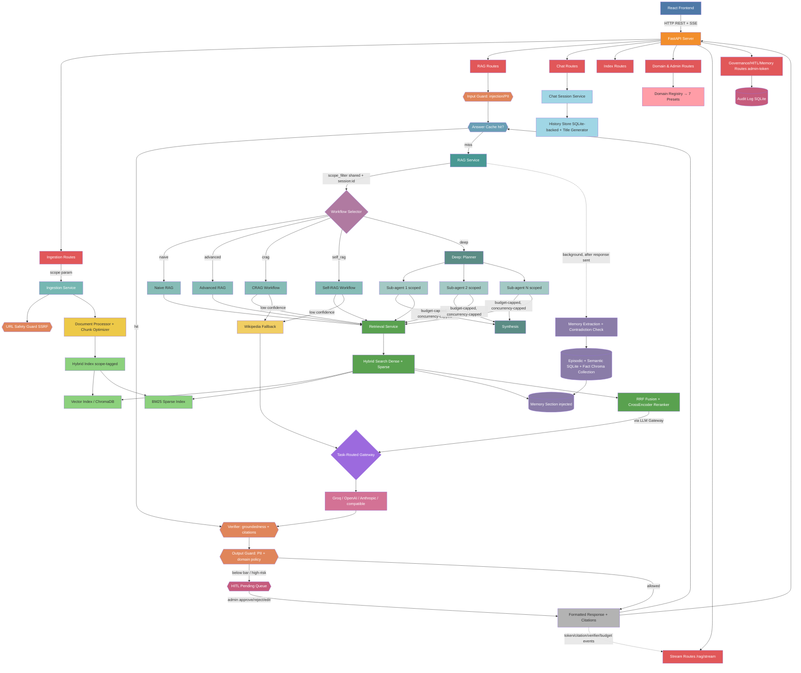

# AutoDocThinker: Agentic RAG System with Intelligent Search Engine

[](https://python.org) [](https://fastapi.tiangolo.com/) [](https://python.langchain.com/) [](https://langchain-ai.github.io/langgraph/) [](https://pytorch.org/) [](https://huggingface.co/) [](https://www.trychroma.com/) [](https://www.docker.com/) [](https://reactjs.org/) [](https://tailwindcss.com/) [](https://groq.com/) [](https://github.com/Md-Emon-Hasan/AutoDocThinker)

Most teams keep their real knowledge locked inside documents nobody has time to read — contracts, medical guidelines, policy manuals, financial reports. **AutoDocThinker** turns that pile into an assistant you can simply ask a question in plain language, and get a straight answer back with the exact source it came from. It checks its own answer against the documents, keeps a record of what it did, and holds back anything it isn't sure about for a human to approve. Hours of reading become one question, each answer costs less to produce, and the result is safe to put in front of customers in fields like healthcare, law, and finance.

Under the hood it is an **Agentic RAG** system on a **Modular Monolithic Architecture** built with **FastAPI, LangGraph, and ChromaDB**, ingesting PDFs, Word docs, URLs, and raw text. A **five-mode workflow engine** — **Naive, Advanced, CRAG, Self-RAG, and Deep (planner + parallel sub-agents + synthesis)** — routes each question to the cheapest path that answers it well, while **Hybrid Search** fuses **dense vector retrieval** with **BM25** through **Reciprocal Rank Fusion** and **CrossEncoder reranking**. Every answer clears a **Verifier Agent** (groundedness + citations) and a **Governance layer** (PII, prompt-injection, SSRF guards, audit trail), backed by **seven domain presets**, **session-scoped index isolation**, a **four-layer cache**, an **LLM Gateway** with ordered fallback, **long-term memory**, and a **streaming chat UI** with an optional **human-in-the-loop** gate. Together these turn a promising demo into something a business can deploy, trust, audit, and afford to run every day.


<!-- 🎥 Project Demo Video -->
[](https://github.com/user-attachments/assets/a18dc570-35fc-4c42-8bad-fd6be37b6c0a)

<!-- 📸 Project Screenshots -->
<p align="center">
  
</p>

<p align="center">
  
</p>

---

## **Live Demo**

**Try it now**: [AutoDocThinker: Agentic RAG System with Intelligent Search Engine](https://autodocthinker.onrender.com/)

---

## **Features & Functionalities**

| #  | Module                   | Technology Stack                        | Implementation Details                                       |
|----|--------------------------|-----------------------------------------|--------------------------------------------------------------|
| 1  | **Backend Framework**    | FastAPI + Uvicorn                       | Async support, auto OpenAPI docs, lifecycle hooks            |
| 2  | **LLM Processing**       | Groq + LLaMA-3-70B                      | Configurable temperature, output parsing, retry logic        |
| 3  | **Document Parsing**     | PyMuPDF + python-docx + BeautifulSoup   | PDF, DOCX, TXT, URL, raw text with metadata preservation     |
| 4  | **Text Chunking**        | RecursiveCharacterTextSplitter          | Adaptive chunk optimizer with configurable size and overlap  |
| 5  | **Vector Embeddings**    | all-MiniLM-L6-v2 (HuggingFace)         | Efficient 384-dimensional dense embeddings                   |
| 6  | **Vector Database**      | ChromaDB                                | Persistent storage, similarity search, source-level deletion |
| 7  | **Sparse Index**         | BM25 (rank-bm25)                        | Keyword-based sparse retrieval with custom tokenizer         |
| 8  | **Hybrid Search**        | Dense + Sparse fusion via RRF           | Reciprocal Rank Fusion merges both retrieval signals         |
| 9  | **Reranking**            | CrossEncoder (sentence-transformers)    | Re-scores top-K candidates for precision-first results       |
| 10 | **Compression**          | LLM-based context compression           | Reduces retrieved chunks to only query-relevant sentences    |
| 11 | **RAG Workflows**        | LangGraph (5 modes)                     | Naive, Advanced, CRAG, Self-RAG, Deep with conditional edges |
| 12 | **Domain Presets**       | 7 domain profiles                       | General, Medical, Legal, Finance, Education, Technical, CS   |
| 13 | **Prompt Engineering**   | Domain-aware prompt templates           | Separate system prompts per domain and per RAG workflow      |
| 14 | **Chat System**          | Session-based multi-turn chat           | Session management, history store, auto title generation     |
| 15 | **Web Fallback**         | Wikipedia API + LangChain               | Auto-triggered on low-confidence or empty index              |
| 16 | **CLI Interface**        | Interactive terminal CLI                | Commands for ingestion, querying, and session management     |
| 17 | **Source Management**    | Per-source ingestion tracking           | Deduplication, source registry, per-source deletion          |
| 18 | **Index Management**     | Full index lifecycle control            | Status, per-source removal, full clear                       |
| 19 | **User Interface**       | React 18 + Vite + Tailwind CSS          | SPA with chat, ingestion, domains, index, and admin pages    |
| 20 | **Containerization**     | Docker + Docker Compose                 | Production-ready multi-service deployment                    |
| 21 | **LLM Gateway**          | Provider abstraction + ordered fallback | Groq/OpenAI/Anthropic/generic-OpenAI-compatible, task-routed model selection, retry on retryable failures only |
| 22 | **Four-Layer Caching**   | `cachetools.TTLCache` x4                | Embeddings, reranking, query→answer, Wikipedia — each a separate thread-safe layer with its own TTL/maxsize |
| 23 | **Session-Scoped Isolation** | Metadata-scoped hybrid index        | `shared` + `session:<id>` scopes; BM25 candidate-set restriction (not post-filter) keeps hybrid search genuinely hybrid per session |
| 24 | **Verifier Agent**       | Mechanical citation checks + 1 LLM call | Groundedness scoring, hallucination/unsupported-claim detection, citation validation — one agent, one consolidated Critic |
| 25 | **Governance Layer**     | Regex/heuristic guards + audit log      | Prompt-injection & PII detection, SSRF-safe URL fetching, per-domain output strictness, SQLite audit trail |
| 26 | **Human-in-the-Loop**    | SQLite-backed approval queue            | Config-driven gating (destructive ops, low-groundedness, high-risk domains), off by default, approve/reject/edit |
| 27 | **Long-Term & Semantic Memory** | SQLite + dedicated Chroma collection | Episodic turns + semantic facts, background extraction, supersession on contradiction, token-budgeted injection |
| 28 | **Deep Agent Orchestration** | Planner + scoped sub-agents + synthesis | Dependency-graph-aware parallel dispatch, concurrency cap, four hard budget limits, durable scratchpad |
| 29 | **SSE Streaming**        | `fetch` + `ReadableStream`               | Live step timeline, token-by-token rendering, citations/verifier/budget events, abort cancels the backend workflow |

---

## **Project Structure**

```
AutoDocThinker/
│
├── .github/
│   └── workflows/
│       ├── ci-cd.yml                         # Full CI/CD pipeline (lint → test → build → deploy)
│       └── docker.yml                        # Docker build & push to GHCR on release
│
├── backend/                                  # FastAPI backend application
│   ├── .dockerignore
│   ├── .env.example                          # Environment variables template
│   ├── .flake8                               # Flake8 linting configuration
│   ├── Dockerfile                            # Backend Docker image
│   ├── pyproject.toml                        # Project metadata and tool config
│   ├── requirements.txt                      # Python dependencies
│   ├── run.py                                # Backend entry point (Uvicorn launcher)
│   ├── split.py                              # Dev utility for splitting test output
│   │
│   ├── app/                                  # Main application package
│   │   ├── __init__.py
│   │   ├── application.py                    # FastAPI app factory
│   │   ├── dependencies.py                   # DI container (IoC box)
│   │   ├── exceptions.py                     # Global exception handlers
│   │   ├── lifecycle.py                      # Startup / shutdown hooks
│   │   ├── logging_config.py                 # Structured logging setup
│   │   ├── main.py                           # ASGI entry point
│   │   │
│   │   ├── api/                              # HTTP route handlers
│   │   │   ├── __init__.py
│   │   │   ├── admin_routes.py               # GET /admin/summary, cache stats/clear (admin-token)
│   │   │   ├── chat_routes.py                # Chat session CRUD & query
│   │   │   ├── domain_routes.py              # Domain preset listing
│   │   │   ├── governance_routes.py          # GET /governance/audit (admin-token)
│   │   │   ├── health_routes.py              # GET /health
│   │   │   ├── hitl_routes.py                # HITL pending/approve/reject/edit (admin-token)
│   │   │   ├── index_routes.py               # Index status, clear, per-source/per-scope delete (admin-token)
│   │   │   ├── ingestion_routes.py           # File upload, URL, raw text ingestion (+ scope param)
│   │   │   ├── memory_routes.py              # GET/DELETE /memory/{session_id}
│   │   │   ├── rag_routes.py                 # RAG query, mode listing, profiles
│   │   │   ├── router.py                     # Central router aggregator
│   │   │   ├── security.py                   # X-Admin-Token dependency (fails closed if unset)
│   │   │   └── stream_routes.py              # SSE: POST /rag/stream, /chat/sessions/{id}/messages/stream
│   │   │
│   │   ├── chat/                             # Chat session management
│   │   │   ├── __init__.py
│   │   │   ├── history_store.py              # Chat history store (SQLite-backed via memory_store, Stage 5)
│   │   │   ├── memory.py                     # Legacy list-append helper -- unused, kept (see Memory section)
│   │   │   ├── message.py                    # Message dataclass
│   │   │   ├── service.py                    # Chat service (create/get/query session)
│   │   │   ├── session.py                    # Session model
│   │   │   └── title_generator.py            # Auto-generate session titles via LLM
│   │   │
│   │   ├── cli/                              # Interactive command-line interface
│   │   │   ├── __init__.py
│   │   │   ├── commands.py                   # command_names(): ask/mode/ingest/filter/history/reset/status/help/quit
│   │   │   ├── interactive.py                # Prints command names (no dispatch loop yet -- see CLI section)
│   │   │   └── printing.py                   # Rich terminal output helpers
│   │   │
│   │   ├── core/                             # Core config & constants
│   │   │   ├── __init__.py
│   │   │   ├── config.py                     # RAGConfig frozen dataclass (v4.0.0)
│   │   │   ├── constants.py                  # App-wide constant values
│   │   │   ├── environment.py                # Env var loader
│   │   │   ├── errors.py                     # Base custom exception classes
│   │   │   └── paths.py                      # Path resolution (project_path()) -- distinct from storage/paths.py
│   │   │
│   │   ├── governance/                       # Stage 4: input/output guards + audit
│   │   │   ├── __init__.py
│   │   │   ├── audit.py                      # SQLite audit log (hash + rule id, never raw PII)
│   │   │   ├── input_guard.py                # Injection/PII patterns, SSRF-safe validate_url()
│   │   │   ├── output_guard.py               # PII leakage, groundedness (via Verifier), per-domain policy
│   │   │   └── policy.py                     # Per-domain strictness (General/Legal/Medical/Finance)
│   │   │
│   │   ├── hitl/                             # Stage 4: human-in-the-loop approval gate
│   │   │   ├── __init__.py
│   │   │   ├── gate.py                       # What gets gated (config-driven), off by default
│   │   │   ├── models.py                     # PendingItem dataclass
│   │   │   └── store.py                      # SQLite-backed pending-approval queue
│   │   │
│   │   ├── memory/                           # Stage 5: long-term & semantic memory
│   │   │   ├── __init__.py
│   │   │   ├── extraction.py                 # Background fact extraction + contradiction detection
│   │   │   ├── models.py                     # EpisodicTurn, SemanticFact
│   │   │   ├── retrieval.py                  # Token-budgeted fact selection + prompt section formatting
│   │   │   ├── semantic.py                   # FactIndex: separate Chroma collection for fact embeddings
│   │   │   └── store.py                      # MemoryStore: one SQLite db, two tables, shared retrieval path
│   │   │
│   │   ├── orchestration/                    # Stage 6: `deep` mode's planner/sub-agents/synthesis
│   │   │   ├── __init__.py
│   │   │   ├── budget.py                     # Budget: max LLM calls/tokens/wall-clock/recursion depth
│   │   │   ├── models.py                     # SubTask, SubAgentResult
│   │   │   ├── orchestrator.py                # DeepOrchestrator: dependency-graph-aware parallel dispatch
│   │   │   ├── planner.py                    # Decomposition + is_trivial() bypass (no LLM call for simple queries)
│   │   │   ├── scratchpad.py                 # Durable per-query task list + status (survives restart)
│   │   │   └── subagent.py                   # Scoped sub-agent: its sub-task + its own retrieval, nothing else
│   │   │
│   │   ├── verification/                     # Stage 3: groundedness / hallucination / citations
│   │   │   ├── __init__.py
│   │   │   ├── agent.py                      # VerifierAgent: mechanical checks + one LLM call
│   │   │   ├── citations.py                  # Zero-LLM-call citation validity checks
│   │   │   ├── critic.py                     # The one shared reflection/critique implementation
│   │   │   └── models.py                     # ClaimSupport, VerificationResult
│   │   │
│   │   ├── domain/                           # Domain preset system
│   │   │   ├── __init__.py
│   │   │   ├── defaults.py                   # Default domain selection logic
│   │   │   ├── models.py                     # Domain Pydantic models
│   │   │   ├── registry.py                   # Domain registry (name → preset)
│   │   │   ├── selector.py                   # Domain auto-selector
│   │   │   ├── validator.py                  # Domain input validator
│   │   │   └── presets/                      # Per-domain configuration
│   │   │       ├── __init__.py
│   │   │       ├── customer_support.py
│   │   │       ├── education.py
│   │   │       ├── finance.py
│   │   │       ├── general.py
│   │   │       ├── legal.py
│   │   │       ├── medical.py
│   │   │       └── technical.py
│   │   │
│   │   ├── indexing/                         # Hybrid index (vector + BM25)
│   │   │   ├── __init__.py
│   │   │   ├── bm25_index.py                 # BM25 sparse index implementation
│   │   │   ├── chroma_store.py               # ChromaDB collection wrapper (+ scope_counts, remove_scope)
│   │   │   ├── deduplication.py              # Chunk deduplication logic
│   │   │   ├── embedding_function.py         # Dependency-free hashing embedding (+ Stage 2 cache hook)
│   │   │   ├── hybrid_index.py               # Unified hybrid index (+ .version, scope_counts, remove_scope)
│   │   │   ├── locking.py                    # Thread-safe write locking
│   │   │   ├── persistence.py                # Index persistence helpers
│   │   │   ├── source_registry.py            # Per-source tracking registry
│   │   │   ├── stats.py                      # Index statistics
│   │   │   ├── tokenizer.py                  # Custom BM25 tokenizer
│   │   │   └── vector_index.py               # Vector index operations
│   │   │
│   │   ├── ingestion/                        # Document ingestion pipeline
│   │   │   ├── __init__.py
│   │   │   ├── chunk_optimizer.py            # Adaptive chunking strategy
│   │   │   ├── document.py                   # Document dataclass
│   │   │   ├── document_processor.py         # Load → clean → metadata injection
│   │   │   ├── file_validation.py            # File type and size validation
│   │   │   ├── metadata.py                   # Metadata extraction helpers
│   │   │   ├── service.py                    # Ingestion orchestrator (+ scope param, SSRF guard on URLs)
│   │   │   ├── source_id.py                  # Deterministic source ID generation
│   │   │   ├── supported_types.py            # Allowed file type registry
│   │   │   └── loaders/                      # Format-specific document loaders
│   │   │       ├── __init__.py
│   │   │       ├── base.py                   # Abstract loader interface
│   │   │       ├── docx_loader.py            # DOCX (python-docx) loader
│   │   │       ├── factory.py                # Routes file_type → loader instance
│   │   │       ├── pdf_loader.py             # PDF (PyMuPDF) loader
│   │   │       ├── text_loader.py            # Raw pasted-text loader
│   │   │       ├── txt_loader.py             # Plain .txt file loader
│   │   │       └── url_loader.py             # Web URL scraper (BeautifulSoup) -- synthetic stub, no real fetch yet
│   │   │
│   │   ├── llm/                              # LLM & embedding clients
│   │   │   ├── __init__.py
│   │   │   ├── chain_factory.py              # LangChain chain builder
│   │   │   ├── embedding_client.py           # HuggingFace embedding wrapper
│   │   │   ├── fallback.py                   # fallback_answer(): canned "not enough context" string (unused, distinct from gateway/fallback.py despite the name)
│   │   │   ├── gateway/                      # Stage 1: provider abstraction, task routing, ordered fallback
│   │   │   │   ├── __init__.py
│   │   │   │   ├── client.py                 # LLMGateway, TaskBoundClient (drop-in .answer() adapter)
│   │   │   │   ├── fallback.py                # with_fallback(): the one real fallback-chain implementation
│   │   │   │   ├── models.py                 # TaskCategory, GatewayRequest/Response, Provider protocol
│   │   │   │   └── routing.py                # Task → model resolution + complexity escalation
│   │   │   ├── groq_client.py                # Groq API client (LLaMA-3)
│   │   │   ├── output_parser.py              # Structured LLM output parser
│   │   │   └── wikipedia_client.py           # Wikipedia API client
│   │   │
│   │   ├── prompts/                          # Prompt templates
│   │   │   ├── __init__.py
│   │   │   ├── answer.py                     # Final answer generation prompt
│   │   │   ├── base.py                       # Base prompt template
│   │   │   ├── compression.py                # Context compression prompt
│   │   │   ├── crag.py                       # CRAG-specific prompts
│   │   │   ├── evaluation.py                 # Relevance evaluation prompt
│   │   │   ├── query_rewrite.py              # Query rewriting prompt
│   │   │   ├── self_rag.py                   # Self-RAG reflection prompts
│   │   │   └── domain/                       # Domain-specific system prompts
│   │   │       ├── __init__.py
│   │   │       ├── customer_support.py
│   │   │       ├── education.py
│   │   │       ├── finance.py
│   │   │       ├── general.py
│   │   │       ├── legal.py
│   │   │       ├── medical.py
│   │   │       └── technical.py
│   │   │
│   │   ├── rag/                              # RAG orchestration layer
│   │   │   ├── __init__.py
│   │   │   ├── citations.py                  # Citation extraction and formatting
│   │   │   ├── formatting.py                 # Response formatter
│   │   │   ├── history.py                    # Conversation history helpers
│   │   │   ├── modes.py                      # RAG mode enum (naive/advanced/crag/self_rag/deep)
│   │   │   ├── service.py                    # RAG service (query entry point: guards, cache, verify, HITL)
│   │   │   ├── state.py                      # LangGraph shared state schema (+ DeepState)
│   │   │   └── streaming.py                  # SSE event generator mirroring RAGService.query()'s stages
│   │   │
│   │   ├── retrieval/                        # Retrieval & ranking pipeline
│   │   │   ├── __init__.py
│   │   │   ├── bm25_search.py                # BM25 sparse search
│   │   │   ├── compressor.py                 # LLM-based chunk compressor
│   │   │   ├── filters.py                    # Metadata filters + scope_filter() (session isolation)
│   │   │   ├── fusion.py                     # Reciprocal Rank Fusion (RRF)
│   │   │   ├── hybrid_search.py              # Combined dense + sparse search
│   │   │   ├── ranking.py                    # Score normalization & ranking (distinct from scoring.py)
│   │   │   ├── reranker.py                   # CrossEncoder reranker (+ Stage 2 rerank-cache hook)
│   │   │   ├── scoring.py                    # Vector/BM25 score combination (distinct from ranking.py)
│   │   │   ├── service.py                    # Retrieval service (main interface)
│   │   │   └── vector_search.py              # ChromaDB vector search
│   │   │
│   │   ├── schemas/                          # Pydantic request/response schemas
│   │   │   ├── __init__.py
│   │   │   ├── chat.py                       # Chat session schemas
│   │   │   ├── common.py                     # Shared base schemas
│   │   │   ├── domain.py                     # Domain schemas
│   │   │   ├── error.py                      # Error response schema
│   │   │   ├── health.py                     # Health check schema
│   │   │   ├── hitl.py                       # HITLDecisionRequest, HITLEditRequest
│   │   │   ├── history.py                    # History schemas
│   │   │   ├── index.py                      # Index schemas
│   │   │   ├── ingestion.py                  # Ingestion request/response schemas (+ scope)
│   │   │   ├── memory.py                     # MemoryOut, MemoryDeleteOut
│   │   │   ├── rag.py                        # RAG query request/response (+ scope, verification, governance, hitl)
│   │   │   ├── rag_profile.py                # RAG profile schema
│   │   │   └── source.py                     # Source metadata schema
│   │   │
│   │   ├── storage/                          # File and vector storage management
│   │   │   ├── __init__.py
│   │   │   ├── cleanup.py                    # File-existence helper (distinct from core/paths.py)
│   │   │   ├── file_storage.py               # File system operations
│   │   │   ├── paths.py                      # Directory-creation helper (distinct from core/paths.py)
│   │   │   ├── upload_storage.py             # Upload directory management
│   │   │   └── vector_storage.py             # Vector store path management
│   │   │
│   │   ├── utils/                            # Shared utility modules
│   │   │   ├── __init__.py
│   │   │   ├── cache.py                      # Stage 2: TTLCacheLayer, CacheManager (4 layers)
│   │   │   ├── hashing.py                    # Content hashing (SHA-256)
│   │   │   ├── retry.py                      # Exponential backoff retry decorator
│   │   │   ├── serialization.py              # JSON serialization helpers
│   │   │   ├── testing.py                    # Test utility helpers
│   │   │   ├── text.py                       # Text normalization utilities
│   │   │   ├── time.py                       # Timestamp helpers
│   │   │   └── validation.py                 # Input validation utilities
│   │   │
│   │   └── workflows/                        # LangGraph workflow definitions
│   │       ├── __init__.py
│   │       ├── finalize.py                   # Shared finalization node
│   │       ├── advanced/                     # Advanced RAG workflow
│   │       │   ├── __init__.py
│   │       │   ├── compat.py                 # Test-only convenience factory (build_advanced_rag)
│   │       │   ├── edges.py                  # Conditional edge logic
│   │       │   ├── graph.py                  # LangGraph graph definition
│   │       │   └── nodes.py                  # Workflow node functions
│   │       ├── crag/                         # Corrective RAG workflow
│   │       │   ├── __init__.py
│   │       │   ├── compat.py
│   │       │   ├── edges.py
│   │       │   ├── graph.py
│   │       │   └── nodes.py
│   │       ├── deep/                         # Stage 6: fifth mode -- planner + sub-agents + synthesis
│   │       │   ├── __init__.py
│   │       │   ├── compat.py                 # Test-only convenience factory (build_deep_rag)
│   │       │   ├── edges.py                  # No conditional edges -- fan-out lives in orchestrator/
│   │       │   ├── graph.py                  # Single-node StateGraph delegating to DeepOrchestrator
│   │       │   └── nodes.py                  # orchestrate_node
│   │       ├── naive/                        # Naive RAG workflow
│   │       │   ├── __init__.py
│   │       │   ├── compat.py
│   │       │   ├── edges.py
│   │       │   ├── graph.py
│   │       │   └── nodes.py
│   │       └── self_rag/                     # Self-RAG workflow
│   │           ├── __init__.py
│   │           ├── compat.py
│   │           ├── edges.py
│   │           ├── graph.py
│   │           └── nodes.py
│   │
│   ├── data/                                  # Runtime-created (gitignored)
│   │   ├── vector_store/                     # ChromaDB persistent storage (documents)
│   │   ├── chroma_memory/                    # ChromaDB persistent storage (semantic facts, Stage 5 -- separate collection)
│   │   ├── governance_audit.sqlite3          # Stage 4 audit log
│   │   ├── hitl.sqlite3                      # Stage 4 HITL pending-approval queue
│   │   └── memory.sqlite3                    # Stage 5 episodic/semantic store + Stage 6 scratchpad table
│   │
│   ├── notebooks/
│   │   └── experiment.ipynb                  # Exploratory experiments
│   │
│   ├── uploads/                              # User-uploaded documents (runtime)
│   │
│   └── tests/                               # Full test suite
│       ├── conftest.py                       # Shared fixtures and DI overrides
│       ├── api/
│       │   ├── test_admin_auth.py            # Every admin-token-protected endpoint (Stage 4)
│       │   ├── test_admin_routes.py
│       │   ├── test_chat_routes.py
│       │   ├── test_domain_routes.py
│       │   ├── test_health_route.py
│       │   ├── test_index_routes.py
│       │   ├── test_ingest_text_routes.py
│       │   ├── test_ingestion_routes.py
│       │   ├── test_rag_routes.py
│       │   ├── test_stream_routes.py         # SSE event order, keepalive, disconnect, cache-hit streaming (Stage 6)
│       │   └── test_upload_routes.py
│       ├── chat/
│       │   ├── test_chat_service.py
│       │   ├── test_chat_session.py
│       │   ├── test_history_store.py
│       │   ├── test_make_message.py
│       │   ├── test_memory.py
│       │   └── test_title_generator.py
│       ├── core/
│       │   ├── test_application.py
│       │   ├── test_c_l_i.py
│       │   ├── test_config.py
│       │   ├── test_constants.py
│       │   ├── test_environment.py
│       │   ├── test_errors.py
│       │   ├── test_lifecycle_and_exceptions.py
│       │   ├── test_logging.py
│       │   └── test_paths.py
│       ├── domain/
│       │   ├── test_defaults.py
│       │   ├── test_domain_profile.py
│       │   ├── test_domain_prompt_constants.py
│       │   ├── test_registry.py
│       │   ├── test_selector.py
│       │   └── test_validator.py
│       ├── governance/                       # Stage 4
│       │   ├── test_audit.py
│       │   ├── test_fail_modes.py            # fail-closed (input) / fail-closed-high-risk (output)
│       │   ├── test_input_guard.py           # injection, PII, SSRF (file://, localhost, private IP)
│       │   └── test_output_guard.py           # per-domain strictness, consumes Verifier result
│       ├── hitl/                              # Stage 4
│       │   ├── test_gate.py                  # gating per config, off by default, approve/reject/edit, expiry
│       │   └── test_hitl_persistence.py       # pending items + decisions survive a simulated restart
│       ├── indexing/
│       │   ├── test_b_m25_index.py
│       │   ├── test_b_m25_search.py
│       │   ├── test_chroma_store.py
│       │   ├── test_compressor.py
│       │   ├── test_deduplication.py
│       │   ├── test_filters.py
│       │   ├── test_fusion.py
│       │   ├── test_hybrid_index.py
│       │   ├── test_hybrid_search.py
│       │   ├── test_index_version.py         # Stage 2: version bumps on ingest/delete, stale key misses
│       │   ├── test_locking.py
│       │   ├── test_persistence.py
│       │   ├── test_ranking.py
│       │   ├── test_reranker.py
│       │   ├── test_retrieval_service.py
│       │   ├── test_scope_isolation.py       # Stage 2: cross-session leak test (dense + BM25 + answer cache)
│       │   ├── test_scope_lifecycle.py       # Stage 2: DELETE /index/scope/{scope}, per-scope status
│       │   ├── test_scoring.py
│       │   ├── test_source_registry.py
│       │   ├── test_stats.py
│       │   ├── test_tokenizer.py
│       │   ├── test_vector_index.py
│       │   └── test_vector_search.py
│       ├── ingestion/
│       │   ├── test_base_loader.py
│       │   ├── test_chunk_optimizer.py
│       │   ├── test_document.py
│       │   ├── test_document_processor.py
│       │   ├── test_docx_loader.py
│       │   ├── test_file_validation.py
│       │   ├── test_ingestion_service.py
│       │   ├── test_loader_factory.py
│       │   ├── test_metadata.py
│       │   ├── test_pdf_loader.py
│       │   ├── test_source_id.py
│       │   ├── test_standalone_functions.py
│       │   ├── test_supported_types.py
│       │   ├── test_text_loader.py
│       │   ├── test_txt_loader.py
│       │   └── test_url_loader.py
│       ├── llm/
│       │   ├── test_chain_factory.py
│       │   ├── test_embedding_client.py
│       │   ├── test_fallback.py
│       │   ├── test_fallback_chain.py         # Stage 1: retryable vs non-retryable, attempt cap, exhaustion
│       │   ├── test_gateway_client.py         # Stage 1: provider abstraction, LLM_GATEWAY_ENABLED=false path
│       │   ├── test_groq_client.py
│       │   ├── test_output_parser.py
│       │   ├── test_prompts.py
│       │   ├── test_routing.py                # Stage 1: task → model routing, complexity escalation
│       │   └── test_wikipedia.py
│       ├── memory/                            # Stage 5
│       │   ├── test_budget.py                 # token-count cap (not record count), confidence×recency ranking
│       │   ├── test_conflicts.py              # supersession; superseded facts never retrieved
│       │   ├── test_decay_and_deletion.py     # decay; delete removes records + embeddings; cascade
│       │   ├── test_episodic_persistence.py   # survives restart; history_store interface unchanged
│       │   ├── test_extraction.py             # background, never blocks, failure isolated, dedupes
│       │   ├── test_memory_not_citable.py
│       │   ├── test_semantic_retrieval.py     # scope-filtered; cross-session leak test; separate collection
│       │   └── test_store.py
│       ├── orchestration/                     # Stage 6
│       │   ├── test_orchestration_budget.py   # all four caps; partial synthesis on exhaustion
│       │   ├── test_parallel.py               # genuine concurrency, cap respected, dependencies, 1 failure ≠ batch failure
│       │   ├── test_planner.py                # decomposition, dependency graph, caps, trivial bypass
│       │   ├── test_scratchpad.py             # persistence, status, survives restart
│       │   ├── test_subagent.py               # cannot see full state / reach outside scope; failure isolation
│       │   └── test_synthesis.py              # citation merge/dedup, verification runs once
│       ├── rag/
│       │   ├── test_advanced_workflow.py
│       │   ├── test_c_r_a_g_workflow.py
│       │   ├── test_citations.py
│       │   ├── test_deep_workflow.py          # Stage 6: registered as 5th mode; original 4 unaffected (regression)
│       │   ├── test_finalize.py
│       │   ├── test_history.py
│       │   ├── test_modes.py
│       │   ├── test_naive_workflow.py
│       │   ├── test_process_query.py
│       │   ├── test_r_a_g_service.py
│       │   ├── test_self_r_a_g_workflow.py
│       │   ├── test_state.py
│       │   └── test_streaming_service.py      # Stage 6: token streaming, node events for all 5 modes, budget events
│       ├── schemas/
│       │   └── test_schemas.py
│       ├── storage/
│       │   └── test_storage.py
│       ├── utils/
│       │   ├── test_cache_keys.py             # Stage 2: one test per answer-cache-key component
│       │   ├── test_cache_layers.py           # Stage 2: 4 independent layers, never-cache-failure, TTL, stats
│       │   └── test_utils.py
│       └── verification/                      # Stage 3
│           ├── test_citation_checks.py        # zero-LLM-call mechanical checks
│           ├── test_critic_consolidation.py   # Self-RAG unchanged; one real reflection implementation
│           └── test_verifier_agent.py         # structured output, retry-then-degrade, at-most-one regeneration
│
├── frontend/                                 # React frontend application
│   ├── .dockerignore
│   ├── .gitignore
│   ├── Dockerfile                            # Frontend Docker image (runs `vite dev` directly, no Nginx)
│   ├── eslint.config.js                      # Stage 6: ESLint flat config
│   ├── index.html                            # HTML entry point
│   ├── package.json                          # Node.js dependencies (+ vitest, testing-library, eslint)
│   ├── package-lock.json
│   ├── README.md
│   ├── vite.config.js                        # Vite bundler config (+ vitest test config, dev proxy)
│   ├── public/
│   │   └── favicon.svg
│   └── src/
│       ├── api.js                            # Centralized API client (+ Stage 6 SSE streaming client)
│       ├── api.test.js                       # Stage 6: frame parsing, event handling, abort, fetch
│       ├── App.jsx                           # Root component with page routing
│       ├── index.css                         # Global Tailwind CSS styles
│       ├── main.jsx                          # React entry point
│       ├── setupTests.js                     # Vitest + jest-dom setup
│       └── components/
│           ├── AdminPage.jsx                 # System summary dashboard
│           ├── ChatPage.jsx                  # Multi-turn AI chat interface (+ Stage 6 streaming UI)
│           ├── ChatPage.test.jsx             # Stage 6: step timeline, terminal states, budget, abort, fallback
│           ├── DomainsPage.jsx               # Domain preset browser
│           ├── IndexPage.jsx                 # Index status and management
│           ├── IngestPage.jsx                # Document upload / URL / text ingestion
│           └── Sidebar.jsx                   # Navigation sidebar
│
├── .gitignore
├── demo.mp4                                  # Project demo video
├── demo.png                                  # Project screenshot
├── docker-compose.yml                        # Multi-service orchestration
├── Dockerfile                                # Root multi-stage Docker image
├── LICENSE
├── README.md
├── render.yml                                # Render.com deployment config
└── run.py                                    # Root entry point (starts backend)
```

---

## **System Architecture**



---

## **Installation**

### Prerequisites

- Python 3.11+
- Node.js 18+ (for frontend)
- Groq API Key

### Using pip

```bash
# Clone the repository
git clone https://github.com/Md-Emon-Hasan/AutoDocThinker.git
cd AutoDocThinker

# Create virtual environment
python -m venv venv
source venv/bin/activate  # Windows: venv\Scripts\activate

# Install backend dependencies
cd backend
pip install -r requirements.txt

# Copy and configure environment
cp .env.example .env
# Edit .env with your API keys

# Run the backend
python run.py
```

### Using Docker

The project includes a **Root Multi-stage Dockerfile** that builds both the React frontend and the FastAPI backend into a single deployable container.

```bash
# RECOMMENDED: Build and run with Docker Compose
docker-compose up -d --build

# OR: Build the root Docker image manually
docker build -t auto-doc-thinker .

# Run the container
docker run -p 5000:5000 --env-file backend/.env auto-doc-thinker
```

---

## **API Endpoints**

| Endpoint | Method | Admin Token? | Description |
|----------|--------|:---:|-------------|
| `/health` | GET | | Health check |
| `/docs` | GET | | Swagger interactive API documentation |
| `/redoc` | GET | | ReDoc API documentation |
| `/rag-modes` | GET | | List available RAG modes (now 5: naive/advanced/crag/self_rag/deep) |
| `/rag-profiles` | GET | | List RAG profiles per domain |
| `/rag/query` | POST | | Run a RAG query. Accepts an optional `scope` (defaults to a private per-caller session scope, never `shared`); response gains optional `verification`, `governance`, `hitl` fields |
| `/rag/stream` | POST | | **Stage 6:** SSE-streamed version of `/rag/query` -- same body shape, `text/event-stream` response |
| `/ingest/source` | POST | | Ingest from a file path or URL source. Accepts an optional `scope`; URL sources pass the SSRF guard first |
| `/ingest/upload` | POST | | Upload a file (PDF / DOCX / TXT). Accepts an optional `scope` form field |
| `/ingest/text` | POST | | Ingest raw pasted text. Accepts an optional `scope` |
| `/ingest/auto` | POST | | Bulk-ingest `data_dir` as the curated **`shared`** corpus (the one ingestion path that defaults to `shared`, not a private scope) |
| `/index/status` | GET | | Index stats, now including `index_version` and per-scope, per-index-type (`dense`/`bm25`) chunk counts |
| `/index/source/{source_id}` | DELETE | ✅ | Remove a specific ingested source (cascades to both indices) |
| `/index/scope/{scope}` | DELETE | ✅ | **Stage 2:** remove every chunk in a scope from both indices (session lifecycle) |
| `/index` | DELETE | ✅ | Clear the entire index |
| `/chat/sessions` | POST | | Create a new chat session |
| `/chat/sessions/{id}` | GET | | Retrieve an existing session |
| `/chat/sessions/{id}/select-profile` | POST | | Set domain and RAG mode for a session |
| `/chat/sessions/{id}/messages` | POST | | Send a message in a session (this session's scope is always `session:<id>`, chosen automatically) |
| `/chat/sessions/{id}/messages/stream` | POST | | **Stage 6:** SSE-streamed version of the above, same session-scoping and history persistence |
| `/domains` | GET | | List all available domain presets |
| `/admin/summary` | GET | ✅ | System summary (domains, chunk count) |
| `/admin/cache/stats` | GET | ✅ | **Stage 2:** per-layer `{size, maxsize, ttl, hits, misses, hit_rate}` |
| `/admin/cache/clear` | POST | ✅ | **Stage 2:** clear one layer (`?layer=`) or all |
| `/governance/audit` | GET | ✅ | **Stage 4:** paginated audit log (rule id + hash, never raw PII) |
| `/hitl/pending` | GET | ✅ | **Stage 4:** paginated pending-approval queue |
| `/hitl/{id}/approve` | POST | ✅ | **Stage 4:** approve a pending item |
| `/hitl/{id}/reject` | POST | ✅ | **Stage 4:** reject a pending item (reason required in body) |
| `/hitl/{id}/edit` | POST | ✅ | **Stage 4:** human-edit the output, then approve |
| `/memory/{session_id}` | GET | | **Stage 5:** paginated episodic turns + active semantic facts |
| `/memory/{session_id}` | DELETE | | **Stage 5:** removes episodic + semantic records **and** their fact embeddings |

---

## **Usage**

1. **Select a Domain**: Choose the domain that best matches your documents (e.g., Medical, Legal, Finance)
2. **Select a RAG Mode**: Pick `naive` for speed, `advanced` for quality, `crag` or `self_rag` for highest accuracy, or `deep` for multi-part questions that benefit from decomposition into parallel sub-agents
3. **Upload a Document**: Choose PDF, DOCX, TXT, paste a URL, or type raw text directly
4. **Click "Ingest"**: System loads, chunks, embeds, and indexes into the Hybrid Index (Vector + BM25)
5. **Ask Questions**: Chat with your documents using natural language in the Chat page
6. **Get AI Answers**: Responses include source citations; if no relevant documents exist, Wikipedia fallback activates automatically
7. **Manage Index**: Use the Index page to view ingested sources or remove specific documents

---

## **CI/CD Pipeline**

This project uses **GitHub Actions** for continuous integration and deployment.

### Pipeline Stages

```
┌────────────────────────────┐    ┌──────────┐    ┌──────────┐
│  backend-test              │───▶│  build-  │───▶│  deploy  │
│  (isort, Black, Flake8,    │    │  docker  │    │ (Render, │
│   pytest --cov)            │    │ (backend │    │  master  │
├────────────────────────────┤    │  + fe    │    │  only)   │
│  frontend-build            │───▶│  images) │    │          │
│  (eslint, vitest, vite     │    │          │    │          │
│   build)                   │    │          │    │          │
└────────────────────────────┘    └──────────┘    └──────────┘
```

`backend-test` and `frontend-build` run in parallel; `build-docker` waits on both; `deploy` only runs on pushes to `master`.

### Workflow Files

| File | Trigger | Purpose |
|------|---------|---------|
| `ci-cd.yml` | Push/PR to main | Full CI/CD pipeline |
| `docker.yml` | Release published | Build & push to GHCR |

### Required Secrets

| Secret | Description |
|--------|-------------|
| `GROQ_API_KEY` | Groq API key for test runs |
| `RENDER_DEPLOY_HOOK` | Render deploy webhook URL |

---

## **Author**

**Md Emon Hasan**

- Email: [emon.mlengineer@gmail.com](mailto:emon.mlengineer@gmail.com)
- Portfolio: [Md-Emon-Hasan](https://emonlabs-ai.hitechparks.com/)
- LinkedIn: [md-emon-hasan](https://www.linkedin.com/in/md-emon-hasan-695483237/)
- GitHub: [Md-Emon-Hasan](https://github.com/Md-Emon-Hasan)
- Facebook: [Md-Emon-Hasan](https://www.facebook.com/mdemon.hasan2001/)
- WhatsApp: [+8801834363533](https://wa.me/8801834363533)

---

## **License**

MIT License - see [LICENSE](LICENSE) file for details.

---

## **Contributing**

Contributions are welcome! Please feel free to submit a Pull Request.

1. Fork the repository
2. Create your feature branch (`git checkout -b feature/AmazingFeature`)
3. Commit your changes (`git commit -m 'Add some AmazingFeature'`)
4. Push to the branch (`git push origin feature/AmazingFeature`)
5. Open a Pull Request
